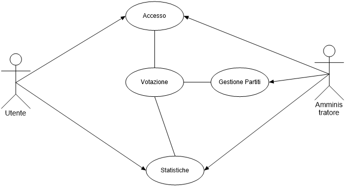

# SCHEMI UML

## UML USE CASE

### Attori
- **Utente**: è l'utente che utilizza l'applicazione per accedere e effettuare la votazione e visualizzare le statistiche
- **Amministratore**: è l'utente che gestisce l'applicazione, può aggiungere, modificare e cancellare i partitipolitici e avviare il conteggio dei voti

### Use Case
- **Accesso**
    - **Login**: l'utente si autentica e riceve un PIN per la SEE
    - **Logout**: l'utente si disconnette
- **Votazione**
    - **Vota Partito**: l'utente vota un partito politico
    - **Esprimi preferenza**: l'utente esprime la sua preferenza dei due candidati
- **Gestione Partiti**
    - **Aggiungi Partito**: l'amministratore aggiunge un partito politico
    - **Modifica Partito**: l'amministratore modifica un partito politico
    - **Cancella Partito**: l'amministratore cancella un partito politico
- **Statistiche**
    - **Visualizza Statistiche**: l'utente visualizza le statistiche dei voti
    - **Conteggia Voti**: l'amministratore avvia il conteggio dei voti

